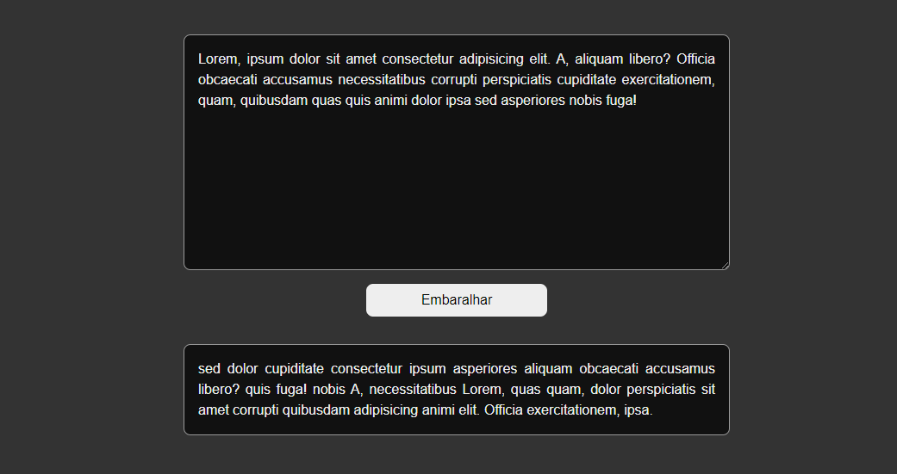

<h1 align="center">
  Embaralhador de Palavras
</h1>

 

  

Esta pequena aplicação que utiliza JavaScript para pegar o texto que você digitar no campo especificado e cria um texto novo embaralhando a ordem das palavras.

---

<h4 align="center"> Feito com ♥ por Marcelino Teixeira </h4>
